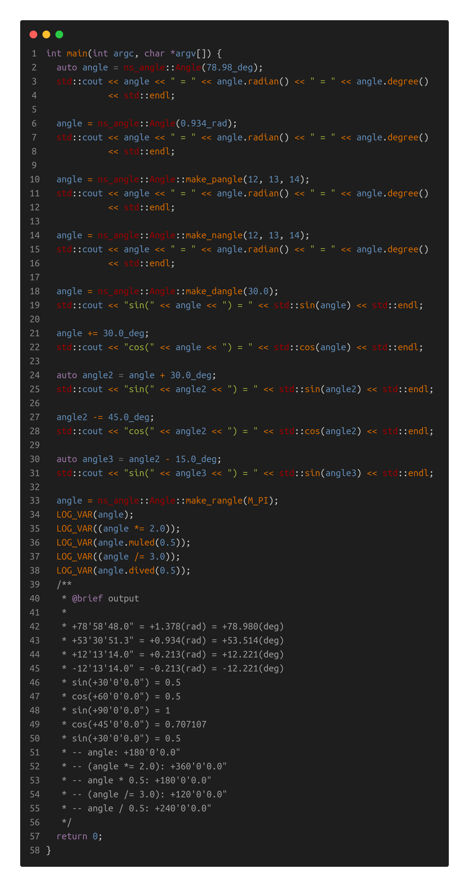

# ___Angle___ Calculation

[TOC]

___Author Info___

___Name___  csl  
___Email___ 3079625093@qq.com

```cpp
                              _|            
  _|_|_|  _|_|_|      _|_|_|  _|    _|_|    
_|    _|  _|    _|  _|    _|  _|  _|_|_|_|  
_|    _|  _|    _|  _|    _|  _|  _|        
  _|_|_|  _|    _|    _|_|_|  _|    _|_|_|  
                          _|                
                      _|_|                 
```

## 1. Using Example



## 2. Main Classes

### 1) ___Degree___ class


just used to create angle object

+ ___ns_angle::Degree operator""_deg(long double deg)___

+ ___std::ostream& operator<<(std::ostream& os, const Degree& degree)___
```cpp
/**
 * @brief output the Degree object
 */
```
### 2) ___Radian___ class

just used to create angle object

+ ___ns_angle::Radian operator""_rad(long double rad)___

+ ___std::ostream& operator<<(std::ostream& os, const Radian& radian)___
```cpp
/**
 * @brief output the Radian object
 */
```

### 3) ___Angle___ class

___Angle___ class is used to calculate angles. The following is an introduction to some important class member functions.  

+ ___Angle(const ns_angle::Degree& deg)___
```cpp
  /**
   * @brief Construct a new Angle object using degree
   */
```
+ ___Angle(const ns_angle::Radian& rad)___
```cpp
  /**
   * @brief Construct a new Angle object using radian
   */
```
+ ___Angle(int deg, int min = 0, long double sed = 0.0)___
```cpp
  /**
   * @brief Construct a new Angle object using d'm's"
   *
   * @attention positive angle [+30'12'15.0"] equals to Angle(30, 12, 15.0)
   * @attention negative angle [-14'24'46.0"] equals to Angle(-14, -24, -46.0)
   */
```
+ ___static Angle make_pangle(int deg, int min = 0, long double sed = 0.0)___
```cpp
  /**
   * @brief Construct a new positive Angle object using d'm's"
   *
   * @attention [+30'12'15.0"] equals to make_pangle(30, 12, 15.0)
   */
```
+ ___static Angle make_nangle(int deg, int min = 0, long double sed = 0.0)___
```cpp
  /**
   * @brief Construct a new negative Angle object using d'm's"
   *
   * @attention [-14'24'46.0"] equals to make_nangle(14, 24, 46.0)
   */
```
+ ___static Angle make_rangle(long double radian)___
```cpp
  /**
   * @brief Construct a new Angle object using radian system
   *
   * @param radian the radian value
   * @attention Angle(Radian(12.45)) equals to make_rangle(12.45)
   */
```
+ ___static Angle make_dangle(long double degree)___
```cpp
  /**
   * @brief Construct a new Angle object using degree system
   *
   * @param degree the degree value
   * @attention Angle(Degree(12.45)) equals to make_dangle(12.45)
   */
```
+ ___Radian radian() const___
```cpp
  /**
   * @brief get the radian
   */
```
+ ___Degree degree() const___
```cpp
  /**
   * @brief get the degree
   */
```
+ ___operator long double()___
```cpp
  /**
   * @brief used to convert the angle to long double [static_cast]
   */
```

+ ___Angle& add(const ns_angle::Degree& deg)___

+ ___Angle& add(const ns_angle::Radian& rad)___

+ ___Angle& add(int deg, int min = 0, long double sed = 0.0)___

+ ___Angle& add(const Angle& angle)___
```cpp
  /**
   * @brief Self increasing
   */
```

+ ___Angle added(const ns_angle::Degree& deg) const___

+ ___Angle added(const ns_angle::Radian& rad) const___

+ ___Angle added(int deg, int min = 0, long double sed = 0.0) const___

+ ___Angle added(const Angle& angle) const___

```cpp
  /**
   * @brief retuen increasd object based on self
   */
```

+ ___Angle& sub(const ns_angle::Degree& deg)___

+ ___Angle& sub(const ns_angle::Radian& rad)___

+ ___Angle& sub(int deg, int min = 0, long double sed = 0.0)___

+ ___Angle& sub(const Angle& angle)___

```cpp
  /**
   * @brief Self decreasing
   */
```

+ ___Angle subed(const ns_angle::Degree& deg) const___

+ ___Angle subed(const ns_angle::Radian& rad) const___

+ ___Angle subed(int deg, int min = 0, long double sed = 0.0) const___

+ ___Angle subed(const Angle& angle) const___

```cpp
  /**
   * @brief retuen decreasd object based on self
   */
```

+ ___inline std::string to_string(std::size_t prec = 1) const___
```cpp
   /**
   * @brief format the angle to d'm's"
   * @return std::string
   */
```

+ ___std::ostream& operator<<(std::ostream& os, const Angle& angle)___
```cpp
/**
 * @brief output the angle object
 */
```
